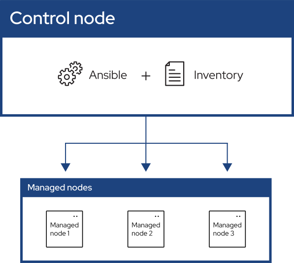
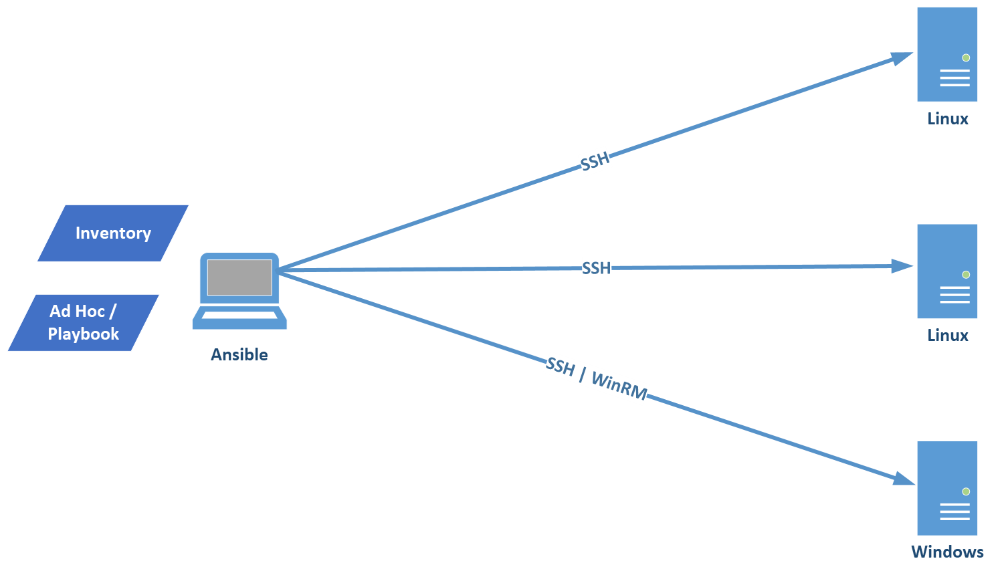

# 🔥Ansible 概要

## 1.1 Ansible是什麼

Ansible是一種[open source](https://github.com/ansible/ansible),並以GPL3作為授權, 其目的在於實現IaC(infrastructure as code), 可用於組態管理、部署等自動化功能。

Ansible最初由Michael DeHaan編寫, 並於2015年被Red Hat收購([wiki](https://zh.wikipedia.org/zh-tw/Ansible_(%E8%BB%9F%E9%AB%94))), 因此可向Red Hat付費要求獲得企業支持及進階功能(Ansible Automation Platform)。
[參閱官網](https://www.redhat.com/en/technologies/management/ansible/pricing)

## 1.2 其它類似工具

* Puppet
* Chef
* SaltStack
* Terraform

**差異比較**

|   工具   |             架構           |    語言/描述方式     |             特點            |         適用場景       |
|----------|---------------------------|---------------------|-----------------------------|-----------------------|
| Puppet   | C/S 架構，有代理 (Agent)   | Ruby DSL，宣告式	   | 成熟度高，強調狀態一致性與合規性| 大型企業，長期配置管理  |
| Chef	   | C/S 架構，有代理	        |Ruby，偏程序式	       | 配置像程式碼一樣靈活，可高度自訂| 複雜應用部署           |
| SaltStack| 事件驅動，支援有代理/無代理 |YAML + Python	       | 傳輸快（ZeroMQ），可即時反應與自動修復 |大規模快速配置、即時監控|
| Terraform | 無代理，宣告式 IaC        |HCL (HashiCorp Config Language)| 偏不可變基礎設施，透過狀態檔追蹤資源 |雲端基礎設施佈署（Day 0 建設）|
| Ansible   | 無代理，透過 SSH/WinRM    |YAML + Jinja2，宣告式 | 冪等性，簡單易用，偏向可變配置 | 系統日常維護（Day 1/Day 2 任務）|

註: Terraform母公司已於2025年被[IBM收購](https://newsroom.ibm.com/2025-02-27-ibm-completes-acquisition-of-hashicorp,-creates-comprehensive,-end-to-end-hybrid-cloud-platform)。

其中這些工具的Terraform和Ansible是有互補性,也是建議拿來搭配使用的, [參閱Ansible及Terraform比較](https://www.redhat.com/en/topics/automation/ansible-vs-terraform)。

## 1.3 Ansible 架構



## 1.4 Ansible 概念
**Control node**

> 用以執行Ansible CLI工具的電腦。

**Manged nodes**

> 即為被管理主機或網路等設備。

**Inventory**

> 可為一個或多個清單來提備被管理的列表, 允許以IP或標籤等特定訊息來進行分組。

**Playbooks**

> 它包含了Plays(Ansible執行的基本單位), 並以yaml格式撰寫, 相較ad-hoc用於簡單不重覆工作場景(例: reboot),</br>
> Playbooks相當於是一份腳本,可完成更複雜的場景。

* Plays 

  > 它負責將受到管理的節點對映到task(任務)上, 並包含了變數、角色、有序的任務清單, 且可重覆執行。

* Roles

  > 是一種結構化、可重用的組織方式, 用來把任務、變數、檔案、模板等資源打包在一起, 方便管理與重複使用。

* Tasks

  > 定義了被管理的節點如何操作。

* handler

  > 這是一種特殊形式的任務, 只有在先前任務通知且導致「變更」狀態時才會執行。

**Modules**

> Ansible複製並在每個受管理節點執行的程式碼或二進位檔（必要時）, 以完成每個任務中定義的動作。</br>
> 每個模組都有其特定用途，從管理特定類型資料庫的使用者，到管理特定網路裝置上的 VLAN 介面。

**Plugins**

> 擴展了Ansible的核心能力的程式碼, 參閱[Working with plugins](https://docs.ansible.com/projects/ansible/latest/plugins/plugins.html#working-with-plugins)。

**Collections**

> 一種將Ansible內容(Playbooks、Roles、Modules、Plugins)封裝並分發的格式, 可透過[Ansible Galaxy](https://galaxy.ansible.com/ui/)來安裝。

## 1.5 運作原理



* Ansible是被設計成Agentless的架構, 其原理是透過SSH或WinRM方式連線目標節點進行操作。

* 除了Linux、Windows外, 基本上也可以操作Unix, 但Unix上未必會安裝Python環境, 因此需進行[安裝相關套件](https://docs.ansible.com/projects/ansible/latest/os_guide/intro_zos.html#ansible-and-z-os-unix-system-services), 否則只有進行有限操作。

* 使用SSH相較於基於WinRM的[傳輸檔案快](https://docs.ansible.com/projects/ansible/latest/os_guide/intro_windows.html#connecting-to-windows-nodes)。

## 1.6 Ansible安裝

**安裝要求**

* Control Node

  > 在任何unix-like並可安裝Python環境的機器上, 例如: Red Hat、Ubuntu、macOS、BSDs, 如果是Windows則需透WSL。

* Managed Node

  > 在被管理的節點上無需安裝Ansible, 但需有Python環境, 以便執行Ansible產生的Python code, 另外須要一個</br>
  > user account來供SSH 連線使用。

**安裝方法**

* 使用Python套件管理程式:
 
  ```bash
    $ python3 -m pip install --user ansible-core
  ```

* 使用OS套件管理程式:

  ```bash 
    ## 各種OS本身有自己的方式來管理套件, 例如: apt, dnf, yum等套件管理程式。

    # Rokcey安裝Ansible
    $ sudo dnf install ansible-core

    # 檢查安裝版本
    $ ansible --version

     ansible [core 2.16.14]
       config file = /etc/ansible/ansible.cfg
       configured module search path = ['/home/edwin/.ansible/plugins/modules', '/usr/share/ansible/plugins/modules']
       ansible python module location = /usr/lib/python3.12/site-packages/ansible
       ansible collection location = /home/edwin/.ansible/collections:/usr/share/ansible/collections
       executable location = /usr/bin/ansible
       python version = 3.12.11 (main, Aug 14 2025, 00:00:00) [GCC 14.3.1 20250617 (Red Hat 14.3.1-2)] (/usr/bin/python3)
       jinja version = 3.1.6
       libyaml = True
  ```

## 1.7 Configuration File

**設定檔搜尋位置及順序**

* ANSIBLE_CONFIG (environment variable if set)
* ansible.cfg (in the current directory)
* ~/.ansible.cfg (in the home directory)
* /etc/ansible/ansible.cfg

**設定檔使用INI格式, #或;被視為註釋。**

```bash
# some basic default values...
inventory = /etc/ansible/hosts  ; This points to the file that lists your hosts       
```

> 注意: 切勿將ansible.cfg隨意放至當前目錄, 如果當前目錄為world-writable（任何使用者都能寫入）, 會導致安全性問題。

**產生一份範例檔**

```bash
  # 產生一個完全註解的範例檔案
  $ ansible-config init --disabled > ansible.cfg

  # 也可以有一個更完整的檔案，包含現有的外掛
  $ ansible-config init --disabled -t all > ansible.cfg
```
